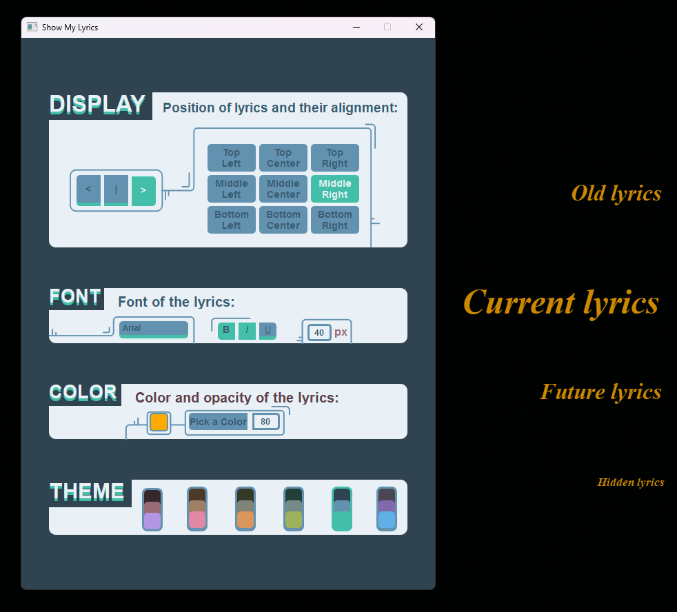

# Show My Lyrics 🎵

A beautiful, customizable desktop application that displays real-time synchronized lyrics for your Spotify music. Built with PyQt6 and featuring multiple themes, font customization, and overlay display capabilities.



## ✨ Features

- **Real-time Lyrics Display**: Synchronized lyrics that update automatically with your Spotify playback
- **Customizable Overlay**: Floating lyrics window that stays on top of other applications
- **Multiple Themes**: 6 beautiful color themes (Red, Orange, Green, Turquoise, Blue, Purple)
- **Font Customization**: Choose from popular fonts with bold, italic, and underline options
- **Flexible Positioning**: 9 different screen positions with left, center, and right alignment
- **Color & Opacity Control**: Customize text color and transparency to match your setup
- **Smooth Animations**: Elegant transitions between lyrics with size and position animations

## 🚀 Quick Start

### Prerequisites

- Python 3.8 or higher
- Spotify Premium account (required for real-time playback data)
- Internet connection for lyrics fetching

### Installation

1. **Clone the repository**
   ```bash
   git clone https://github.com/Ritiam/show-my-lyrics.git
   cd show-my-lyrics
   ```

2. **Install dependencies**
   ```bash
   pip install -r requirements.txt
   ```

3. **Set up Spotify API credentials**
   - Go to [Spotify Developer Dashboard](https://developer.spotify.com/dashboard)
   - Create a new app
   - Copy your Client ID
   - Add "http://127.0.0.1:8888/callback" to Redirect URIs
   - Replace the "CLIENT_ID" in "App.py" line 107 with your Client ID

4. **Run the application**
   ```bash
   python App.py
   ```

## 🎮 Usage

1. **Login**: Click "Log in" to authenticate with your Spotify account
2. **Customize**: Use the interface to adjust:
   - **Display**: Choose position and alignment for lyrics
   - **Font**: Select font family, size, and styling options
   - **Color**: Pick text color and opacity
   - **Theme**: Choose from 6 beautiful color schemes
3. **Enjoy**: Play music on Spotify and watch synchronized lyrics appear!

## 🎨 Themes

| Theme | Colors |
|-------|--------|
| Red | Warm reds with purple highlights |
| Orange | Earthy oranges with pink accents |
| Green | Natural greens with orange highlights |
| Turquoise | Cool teals with lime accents |
| Blue | Ocean blues with teal highlights |
| Purple | Royal purples with sky blue accents |

## 📋 Requirements

```
PyQt6>=6.0.0
spotipy>=2.22.1
requests>=2.31.0
Flask>=2.3.0
lrclib>=1.0.0
```

## 🛠️ Technical Details

### Architecture

- **App.py**: Main application window and UI components
- **LyricDisplayer.py**: Overlay window for lyrics display with animations
- **LyricFetcher.py**: Spotify API integration and lyrics synchronization
- **TokenManager.py**: OAuth2 authentication and token management

### APIs Used

- **Spotify Web API**: For current playback information
- **LrcLib API**: For synchronized lyrics data

### Key Features Implementation

- **OAuth2 PKCE Flow**: Secure Spotify authentication
- **Real-time Sync**: Continuous polling and timestamp matching
- **Smooth Animations**: PyQt6 property animations for seamless transitions
- **Cross-platform**: Compatible with Windows, macOS, and Linux

## 🐛 Troubleshooting

### Common Issues

1. **"No lyrics for this track"**
   - Not all songs have synchronized lyrics available
   - Try popular songs for better lyrics coverage

2. **Authentication fails**
   - Ensure redirect URI is correctly set in Spotify app settings
   - Check that your Client ID is correct

3. **Lyrics not syncing**
   - Make sure you're playing music on the same Spotify account
   - Verify you have Spotify Premium (required for real-time data)

4. **Application won't start**
   - Ensure all dependencies are installed: "pip install -r requirements.txt"
   - Check Python version compatibility

## 🤝 Contributing

Contributions are welcome! Please feel free to submit a Pull Request. For major changes, please open an issue first to discuss what you would like to change.

### Development Setup

1. Fork the repository
2. Create a feature branch: "git checkout -b feature-name"
3. Make your changes
4. Test thoroughly
5. Submit a pull request

## 📄 License

This project is licensed under the MIT License - see the [LICENSE](LICENSE) file for details.

## 🙏 Acknowledgments

- [Spotify Web API](https://developer.spotify.com/documentation/web-api/) for music data
- [LrcLib](https://lrclib.net/) for synchronized lyrics
- [PyQt6](https://doc.qt.io/qtforpython/) for the beautiful UI framework

## 📞 Support

If you encounter any issues or have questions:

1. Check the [Issues](https://github.com/Ritiam/show-my-lyrics/issues) page
2. Create a new issue with detailed information about your problem
3. Include your OS, Python version, and error messages

---

⭐ If you found this project helpful, please consider giving it a star!

## 🔄 Changelog

### v0.6.0
- Initial release
- Real-time Spotify lyrics synchronization
- 6 customizable themes
- Font and color customization
- Overlay display with animations
- OAuth2 authentication